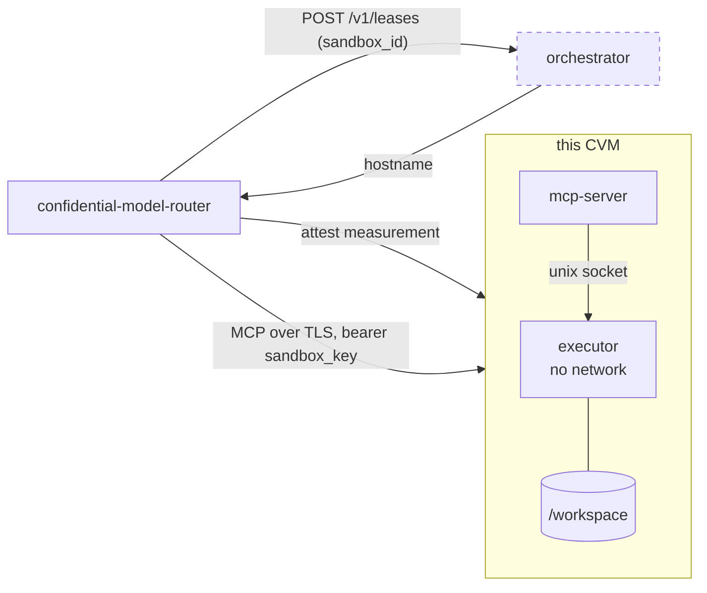

# confidential-agent-sandbox

One tenant's private Linux workspace, inside its own confidential VM,
reached over MCP. This is the workload behind the `agent_sandbox` tool
profile in [confidential-model-router]; the VMs are scheduled by
[agent-sandbox-orchestrator].

It is deliberately not a variant of code execution. Code execution hands a
shared pool of containers out per session and snapshots the workspace to
an encrypted store; a sandbox is a single VM that belongs to one caller
for as long as it lives, and the workspace never leaves it.

## Where it sits



The router derives two independent values from the end user's cache
secret: a pseudonymous `sandbox_id` and a `sandbox_key`. Only the ID
reaches the orchestrator. Before the key is sent, the router attests this
workload's measurement against the pinned source repo. So an
operator-compromised orchestrator can deny service or point the router at
a different VM — and be caught by attestation — but it cannot authenticate
to an occupied sandbox or read a workspace.

This process has no configuration, no secrets, and no idea who its tenant
is. It binds to the first key it is shown and serves nobody else for the
rest of its life. See `main.go` for why trust-on-first-use is sound here.

## Containers

| | |
|---|---|
| **mcp-server** (`:8000`, behind the shim) | Answers the router: the bearer gate, the MCP server, and the six tools. Has a network, no workspace. |
| **executor** (unix socket) | Runs the agent's commands and owns `/workspace`. `network_mode: none` — which is what makes "the sandbox has no network access" a fact rather than a promise made in a prompt. |

The split is the point: mcp-server needs a listener to answer the router,
the executor does not, and the shell only ever runs in the half that has
no way out.

## MCP tools

Served at `POST /mcp` (streamable HTTP, stateless), authenticated with
`Authorization: Bearer <sandbox_key>`.

- `shell` — run a command under `/bin/sh` in `/workspace`; returns stdout,
  stderr, and exit code. Killed after 120 s. Each call is a fresh shell,
  so `cd` and environment variables do not carry over — files do.
- `view` — read a file with line numbers, optionally a `[start, end]` range.
- `present` — render a file inline in the chat as a syntax-highlighted
  code block. The router emits this result verbatim as assistant content,
  so the fence is chosen longer than any backtick run inside the file.
- `str_replace` — replace one exact occurrence of `old_str`.
- `create` — create a file; fails if it already exists.
- `insert` — insert text after a line number.

The names are a contract with the router, whose prompt tells the model to
use exactly these. Renaming one here breaks that prompt silently.

`GET /health` is unauthenticated: the orchestrator polls it to decide
whether a VM is ready and has no key. It reports liveness of both
containers and nothing else.

## Executor API

Internal, over the shared-volume unix socket. mcp-server is its only
client; there is no auth because there is no other way in.

```
POST /exec   {"command": "ls"}    → {"stdout": "...", "stderr": "...", "exit_code": 0}
POST /read   {"path": "a.txt"}    → {"path": "...", "contents": "<base64>"}
POST /write  {"path", "contents"} → {"path": "...", "size": 42}
GET  /health                      → {"status": "ok"}
```

Paths are resolved through `os.Root`, so a traversal or a symlink the
shell planted cannot pull a file tool outside `/workspace`. Output is
capped (128 KB per stream, 8 MB per file, 256 KB per tool result) so a
runaway command cannot fill the model's context window.

## Persistence

`/workspace` is a tmpfs: it survives every turn and every conversation
this VM serves, and nothing beyond the VM. A reset, a health failure, or
host loss destroys it permanently. Durable encrypted persistence is a
separate piece of work — until it exists, "your files are still there
tomorrow" is best effort.

## Development

```sh
cd mcp-server && go test -race ./...
cd executor   && go test -race ./...
```

`mcp-server`'s tests drive the real HTTP surface with the same MCP client
the router uses, over a stand-in executor: if they pass, the router can
talk to this workload. The stand-in reproduces the executor's documented
API — the two modules cannot import each other, so that contract is
checked by hand when it changes.

To run the real pair locally the way the CVM does:

```sh
docker build -t cas-executor ./executor && docker build -t cas-mcp ./mcp-server
docker volume create cas-execsock
docker run -d --name cas-exec --user 1000:1000 --read-only --network none \
  --tmpfs /workspace:size=1g,mode=1777 --tmpfs /tmp:size=512m,mode=1777 \
  --cap-drop ALL --security-opt no-new-privileges -v cas-execsock:/run/execsock cas-executor
docker run -d --name cas-mcp --user 1000:1000 --read-only \
  --cap-drop ALL --security-opt no-new-privileges -v cas-execsock:/run/execsock -p 8000:8000 cas-mcp

curl -s -X POST localhost:8000/mcp \
  -H 'Authorization: Bearer any-key-you-like' \
  -H 'Content-Type: application/json' -H 'Accept: application/json, text/event-stream' \
  -d '{"jsonrpc":"2.0","id":1,"method":"tools/call","params":{"name":"shell","arguments":{"command":"uname -a"}}}'
```

The first key you send binds that container, exactly as in production.

## Releasing

Run **Tinfoil Release** with a version. It builds both images, writes
their digests into `tinfoil-config.yml`, tags the release, and dispatches
the publish workflow to measure and attest it.

Nothing is deployable until that has run: the router resolves the latest
release to a measurement and refuses to show a sandbox key to any VM that
does not match it.

[confidential-model-router]: https://github.com/tinfoilsh/confidential-model-router
[agent-sandbox-orchestrator]: https://github.com/tinfoilsh/agent-sandbox-orchestrator
